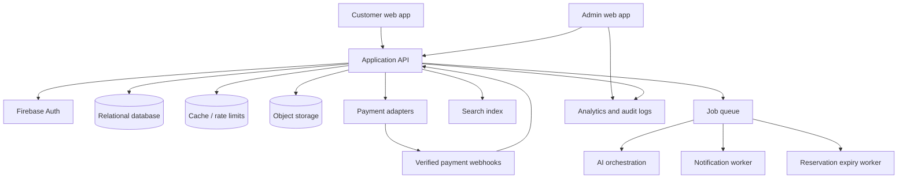

# System Architecture

## 1. Recommended shape

Use a modular web application with a clear domain layer and asynchronous workers. A modular monolith is the preferred launch architecture: it keeps inventory and order transactions close together while allowing AI, notifications, and payment integrations to run behind ports/interfaces. Split services only when scale or team ownership requires it.

## 2. Logical modules

- Identity: Firebase token verification, profile, contact verification, roles.
- Catalog: products, variants, media, categories, collections, attributes, pricing.
- Discovery: search, filters, sorting, recommendations, recently viewed.
- Cart and inventory: cart, reservations, stock ledger, concurrency controls.
- Orders: order lifecycle, payment state, fulfillment, cancellation, shipment.
- Custom design: request intake, reference assets, AI analysis, quote, conversation, production.
- Loyalty: item-count ledger, levels, discount rules, return adjustments.
- Reviews: eligibility, moderation, publication, photos.
- Notifications: templates, preferences, delivery attempts, provider webhooks.
- Admin: operations UI, settings, audit log, permissions.

## 3. Transaction boundaries

### Reservation

Within one database transaction, lock the variant stock row, verify available quantity, create a reservation with `expires_at`, and decrement available stock. A unique/idempotency key prevents duplicate reservations.

### Payment success

Verify the provider event, lock the order, ensure the event has not already been processed, mark payment captured, convert reservation to sold, and emit order-confirmed events. Never rely on a browser redirect as proof of payment.

### Return and loyalty

Create a return request, evaluate policy eligibility, record an immutable decision, then create refund/store-credit records. After admin review, apply the appropriate loyalty adjustment ledger entry.

## 4. Event topics

`reservation.created`, `reservation.expired`, `payment.authorized`, `payment.failed`, `payment.verified`, `order.confirmed`, `order.shipped`, `order.delivered`, `custom.request.created`, `custom.quote.created`, `custom.quote.approved`, `return.approved`, `refund.processed`, `review.submitted`, `notification.requested`.

All consumers must be idempotent, retryable, and dead-lettered after a bounded retry count.

## 5. External integrations

- Firebase Authentication: identity providers and verified contact claims.
- Payment providers: card, Easypaisa, JazzCash, and bank transfer workflow.
- Email, SMS, WhatsApp: notification adapters with template IDs and delivery status.
- AI provider: text/image analysis behind an internal grounding and policy layer.
- Object storage/CDN: product media, customer photos, bank proof, and reference images.

Provider credentials and webhook secrets belong in a secret manager. Every provider adapter must have a sandbox mode and contract tests.

## 6. Consistency and failure policy

- Source of truth for money, stock, orders, and loyalty is the relational database.
- Search and recommendations are eventually consistent projections.
- AI reads an approved catalog/inventory context and cannot write price, stock, or order state.
- Notification failure must not roll back a successful order; it creates a retryable delivery task.
- Payment webhook replay is harmless through event idempotency.
- Scheduled jobs reconcile reservations, payments, shipments, loyalty, and notification failures.