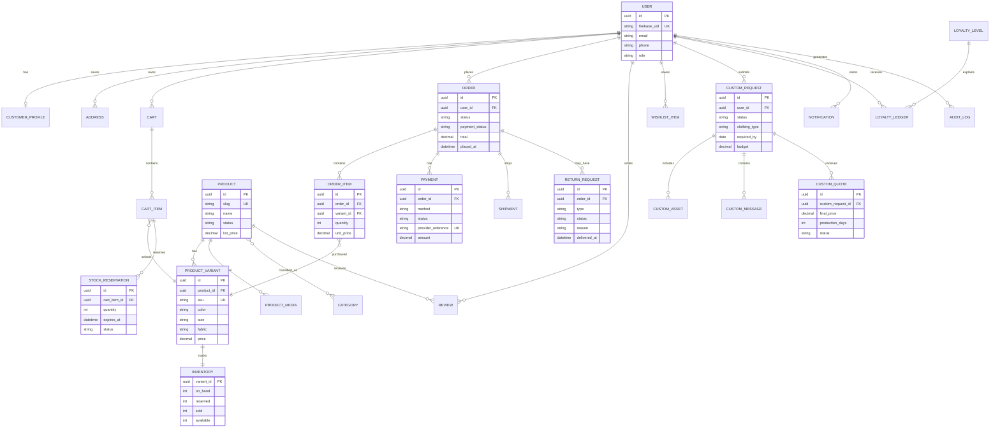

# Data Model and ERD

## 1. ERD

## 2. Required tables and fields

### Identity and customer

`users`, `customer_profiles`, `addresses`, `notification_preferences`, `payment_method_tokens` (provider token only, never raw card data).

### Catalog

`products`, `product_variants`, `product_media`, `categories`, `product_categories`, `collections`, `product_collections`, `size_guides`, `product_attributes`, `price_rules`, `discounts`, `coupons`.

### Commerce

`carts`, `cart_items`, `stock_reservations`, `inventory`, `inventory_ledger`, `orders`, `order_items`, `payments`, `payment_events`, `shipments`, `shipping_zones`, `shipping_rates`, `order_status_history`.

### Custom design

`custom_requests`, `custom_assets`, `custom_analyses`, `custom_messages`, `custom_quotes`, `custom_status_history`.

### Engagement and operations

`wishlists`, `recently_viewed`, `reviews`, `review_media`, `loyalty_levels`, `loyalty_ledgers`, `notifications`, `notification_deliveries`, `admin_users`, `audit_logs`, `support_conversations`.

## 3. Constraints and indexes

- Unique `sku`, product slug, provider payment reference, and Firebase UID.
- Unique active cart item per cart and variant.
- Unique review per customer per order item unless an admin explicitly reopens it.
- Index variant by product, color, size, availability; order by user and created time; reservations by status and expiry; notifications by user and unread state.
- Store money as integer minor units plus currency code; do not use floating point.
- Store timestamps in UTC and render in Pakistan Standard Time where appropriate.
- Soft-delete catalog entities when historical orders reference them.
- Snapshot product name, SKU, variant attributes, tax, shipping, and price in order items.

## 4. Inventory invariants

`available = on_hand - reserved - sold` is represented by transactionally maintained counters and an append-only inventory ledger. The system must reject any operation that would make available stock negative. Expiry processing is idempotent and safe to rerun.

## 5. Loyalty calculation

Use an append-only ledger rather than mutating only a customer counter. Positive entries are settled eligible item quantities. Valid-reason returns create neutral/exclusion entries; invalid returns create negative entries after review. A projection calculates `eligible_item_count`, rank, sublevel, and discount. Rebuild the projection from ledger history when rules change.