# User Flows

## Customer purchase

```mermaid
flowchart LR
  Browse --> Discover[Search/filter/category]
  Discover --> Product[Product page]
  Product --> Variant[Choose color and size]
  Variant --> Cart[Add to cart]
  Cart --> Reserve[30-minute reservation]
  Reserve --> Account{Verified account?}
  Account -- No --> Verify[Create/login; verify email and phone]
  Account -- Yes --> Address[Address]
  Verify --> Address
  Address --> Delivery[Standard delivery and city rate]
  Delivery --> Pay[Card/Easypaisa/JazzCash/bank transfer]
  Pay --> Review[Review order]
  Review --> Confirm[Payment verified and order confirmed]
  Confirm --> Fulfill[Manufacture/pack/ship/deliver]
```

## AI shopping assistant

1. Guest or customer opens the floating assistant.
2. The assistant classifies intent: discovery, product question, size, stock, comparison, shipping, returns, checkout, or custom design.
3. The server retrieves approved catalog, variant inventory, policies, and customer context where authorized.
4. The model answers only from the retrieved context, cites the relevant product/policy context in UI, and marks uncertainty.
5. Sensitive or unresolved cases escalate to built-in chat/admin support.
6. Guest conversations are discarded after the session; signed-in conversations may be stored according to preference and privacy policy.

## Custom design

1. Customer starts a custom request.
2. Form collects design details, measurements, budget, required-by date, instructions, and reference images.
3. AI creates a draft structured analysis with confidence/unknown fields.
4. Admin reviews the original evidence and analysis, asks questions if needed, and sets price and estimate.
5. Customer receives an in-site/email/WhatsApp notification and views the quote.
6. Customer approves or requests a change.
7. On approval, customer pays; request moves to production.
8. Admin communicates milestones through built-in chat and status notifications.

## Return or exchange

1. Customer opens an eligible delivered order within 3 days.
2. Selects return/exchange, item, reason, evidence, and refund destination.
3. System validates timing and basic policy; qualifying requests are automatically approved.
4. Customer ships the item at own cost and submits tracking/proof.
5. Admin receives/inspects the item where required.
6. Refund or exchange is processed immediately after approval/inspection rule is satisfied.
7. Loyalty ledger is updated according to valid or invalid reason outcome.

## Admin order handling

`New -> Payment pending -> Confirmed -> Processing -> Ready to ship -> Shipped -> Out for delivery -> Delivered`.

Admin may add internal notes, contact the customer, correct fulfillment data with an audit trail, and trigger allowed notifications. Payment and inventory states cannot be edited directly without a controlled adjustment action.